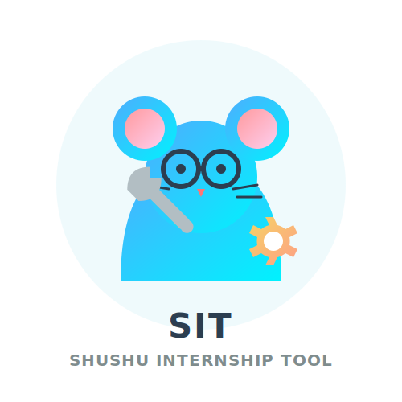

# SIT — shushu internship tool

<p align="center">
  
</p>

<h2 align="center">SIT — shushu internship tool</h2>

<p align="center">
  <a href="README.md">中文</a> | English
</p>

<p align="center">
  
  
  
  
</p>

> Turn a job description into a project, a project into a resume, and a resume into interviews.

> **Recommended setup: use Codex first, and enable Plan mode for the complete yes/no gate, preference-choice popup, and custom-input experience.** If another coding agent supports an interactive Plan / Planning / Ask mode, enable it first; otherwise the project preference flow may degrade to ordinary text input.

Welcome to the Shushu Internship & Employment QQ group: **976187338**.

SIT, short for **shushu internship tool**, is an AI-assisted internship project preparation toolkit. It turns a target JD, meaning **Job Description** or job posting, into a practical project package that you can use for applications, interviews, code walkthroughs, and presentation materials.

A JD usually contains role responsibilities, required skills, tech stacks, business context, location, degree or graduation-year constraints, and other hiring requirements.

The toolkit is designed for computer-industry internship candidates across backend, frontend, full-stack, mobile, test development, data engineering, cloud/DevOps, security, systems, AI, and algorithm roles. It is especially useful for beginners or low-experience candidates who need a fast path from role targeting to project selection, code understanding, project modification, resume writing, and interview drilling.

If you only provide a JD, the workflow first does a quick JD read and then asks a short intake: your current level, current tech stack, time budget, available resources, and desired run depth. The recently added project preference flow can be used as a small signal for open-source repository filtering and ranking.

## Featured Companion Project: VibeResume

**[VibeResume](https://github.com/LiuMengxuan04/vibe-resume)** is an AI-friendly, web-first resume template that keeps your resume as `HTML + CSS`, lets an AI assistant edit both content and layout, and exports the result as a stable one-page PDF.

It works as the last-mile companion to SIT: SIT helps turn a JD into project and interview material, while VibeResume turns the final resume content into a polished, version-controlled, continuously editable web resume.

## Friendly Links & Inspiration

- Friendly link: [Shushu Internship Resume Optimizer](https://github.com/Sunanzhe2004/shushu-internship-resume-optimizer): turns internship code repositories, project notes, and business context into resume achievements, STAR drafts, and interview review materials.
- Friendly link: [ProjectProof](https://github.com/YingaoWang-casia/shushu-ProjectProof): an evidence-based review and interview-hardening tool for thin internship and AI projects, helping candidates explain real experience in greater depth.
- Inspiration: [leilon](https://github.com/leilon). This skill was inspired by related practices and sharing from this GitHub profile.

## What It Does

- Finds 2-3 suitable GitHub projects based on a target JD, then ranks them by role fit, ramp-up speed, interview value, run cost, and modification potential.
- Audits a cloned project and generates `audit.json`, `overview.md`, and `overview.html` to help you understand structure, entry points, dependencies, APIs, UI flows, data flows, and task flows.
- Plans a baseline run path: start with the smallest local run, then move to cloud servers, databases, object storage, GPU/AutoDL, or other remote environments if needed.
- Suggests interview-ready modifications, such as adding APIs, pages, databases, cache, tests, monitoring, CI/CD, data flows, performance optimization, demos, or AI/algorithm experiments.
- Generates an interview pack: STAR resume bullets, core code walkthrough notes, interviewer-style Q&A, PPT prompts, and an application checklist.

## Project Preference

Project preference is a recent addition. It confirms whether you have repository-filtering preferences before project discovery. For coding agents that support interactive planning, enable Plan / Planning / Ask mode. In Codex, this is Plan mode and uses `request_user_input` for the most complete popup experience. Without such a mode, preference confirmation may degrade to ordinary text input.

The flow is: first choose whether you have a preference; choosing “no” keeps the original workflow, while choosing “yes” opens 3 open-source repository filtering suggestions plus the client’s built-in custom input as option D. Codex is recommended for the most stable and complete structured-choice experience.

Preference only adds a small signal to GitHub repository filtering and ranking. The main workflow still finds 2-3 open-source repositories and then plans interview-ready modifications. Expressions such as “do not want,” “avoid,” or “do not depend on” are treated as avoid-tags, not positive preferences.

## Recommended Usage

Send your target JD and personal background to an AI assistant, then choose a run depth. If you already have a clear project preference, you can include it in the first message; the workflow still confirms it before use:

```text
Use shushu internship tool to help me turn the following JD into a computer-industry internship project that I can apply with, explain in interviews, and present clearly.

My background:
- Current level: took CS courses but have few projects
- Familiar languages/frameworks: Python, FastAPI, a bit of React
- Time budget: 2 days
- Local/remote resources: laptop + Docker, no GPU
- Desired run depth: interview-only / smoke-test / local-full-run / remote-full-run
- Project preference / taste: I prefer backend + AI application projects; I want something that can run locally and is easy to explain in interviews; I do not want a pure frontend project or a project that depends on multi-GPU or complex cloud services.

JD (Job Description / job posting):
...
```

If you do not have a preference yet, write “Project preference / taste: none, recommend by JD,” or just provide the JD. After the initial JD read, the workflow always asks one yes/no question: do you have your own project preference / taste? If your first message already contains a preference, the workflow first asks whether to use that text as a custom preference.

## Star History

[](https://www.star-history.com/#LiuMengxuan04/shushu-internship-tool&Date)

## Install Local Scripts

```bash
cd shushu-internship-tool
python3 -m venv .venv
. .venv/bin/activate
python -m pip install -e ".[dev]"
```

## Scripts

Audit a local project:

```bash
python -m shushu_internship_tool.repo_audit --repo /path/to/repo --out reports/audit --name my-project
```

Rank candidate projects without taste, compatible with the old command:

```bash
python -m shushu_internship_tool.candidate_score --jd jd.txt --candidates candidates.json --out reports/ranking
```

Rank candidate projects with an optional project preference / taste file:

```bash
python -m shushu_internship_tool.candidate_score --jd jd.txt --candidates candidates.json --taste taste.json --out reports/ranking
```

`candidate_score` computes `raw_score` first and then normalizes it to 0-100 using `max_raw_score`: 104 when there is no effective taste, and 114 when an effective taste has positive `prefer_tags` and adds the small `user_preference` dimension. Missing `--taste`, an empty file, whitespace-only text, or a file without structured `prefer_tags` / `avoid_tags` is treated as no effective taste; the script does not parse natural-language preferences.

Candidate ranking also does not infer JD fit, license quality, runnability, or resource fit from free text. The AI assistant should write explicit `matched_jd_terms`, `license_score`, `runnable_score`, and `resource_fit_score` fields in the candidate JSON.

Example `taste.json`:

```json
{
  "taste_text": "I prefer backend + AI apps, do not want pure frontend, want Docker local run, and want the project to be interview-friendly.",
  "prefer_tags": ["backend", "ai-app", "local-docker", "interview-friendly"],
  "avoid_tags": ["pure-frontend", "multi-gpu", "cloud-heavy"]
}
```

Create an interview-pack skeleton:

```bash
python -m shushu_internship_tool.interview_pack --project-notes reports/audit --out reports/interview-pack
```

After installation, you can also use the command-line entry points:

```bash
shushu-repo-audit --repo /path/to/repo --out reports/audit --name my-project
shushu-candidate-score --jd jd.txt --candidates candidates.json --out reports/ranking
shushu-candidate-score --jd jd.txt --candidates candidates.json --taste taste.json --out reports/ranking
shushu-interview-pack --project-notes reports/audit --out reports/interview-pack
```

## Candidate JSON Example

```json
[
  {
    "name": "tiny-ticket-system",
    "repo_url": "https://github.com/example/tiny-ticket-system",
    "license": "MIT",
    "license_score": 4,
    "stars": 320,
    "last_commit": "2026-04-20",
    "tags": ["fastapi", "postgresql", "docker", "rest-api"],
    "matched_jd_terms": ["backend development", "API design", "database", "containerized deployment"],
    "jd_match_score": 20,
    "runnable": true,
    "runnable_score": 20,
    "resources": "local Docker smoke-test",
    "resource_fit_score": 10,
    "mod_ideas": ["add JWT auth", "add Redis cache", "add integration tests"],
    "risk_notes": ["database migration needs setup"],
    "taste_tags": ["backend", "local-docker", "interview-friendly", "api", "database"],
    "project_taste_notes": [
      "backend engineering oriented",
      "clear Docker local smoke-test path",
      "API / database / cache modifications are easy to explain in interviews"
    ],
    "avoid_tags": ["cloud-heavy"]
  }
]
```

The taste fields are optional. `taste_tags` describes what user preferences a project can match, `avoid_tags` describes project attributes that some users may want to avoid, and `project_taste_notes` is human-readable explanation only; it does not affect script scoring.

## Job-Search Efficiency Principles

- The first goal is to help candidates get interviews quickly: project title, JD fit, concise resume bullets, and interview Q&A come first.
- Do not spend all your time fully reproducing paper-level results or rewriting an entire system. Start with a smoke test, understand the core flow, and prepare a demo or modification that you can explain clearly.
- Keep modifications focused and interview-friendly. Prioritize small but useful increments that can move fast, such as APIs, pages, tests, cache, deployment, performance, data processing, or algorithm experiments.
- If you have metrics, write concrete numbers. If you do not, describe engineering output, method understanding, system design, experiment design, and next steps.
- Interview preparation matters more than perfect experiments: let an AI assistant repeatedly question you until you can explain input/output, design choices, failure reasons, and improvement directions.

## Run Depth

- `interview-only`: Do not fully run the project. Focus on project selection, resume bullets, core-code reading path, interview Q&A, and PPT prompts.
- `smoke-test`: Run the smallest possible path to prove the project starts or the core flow works.
- `local-full-run`: Run the full baseline/demo locally and produce presentable output where possible.
- `remote-full-run`: Use cloud servers, databases, GPUs, or other remote resources for a full run when time and budget allow.

## Development

```bash
cd shushu-internship-tool
. .venv/bin/activate
pytest
```

## License

Apache-2.0
