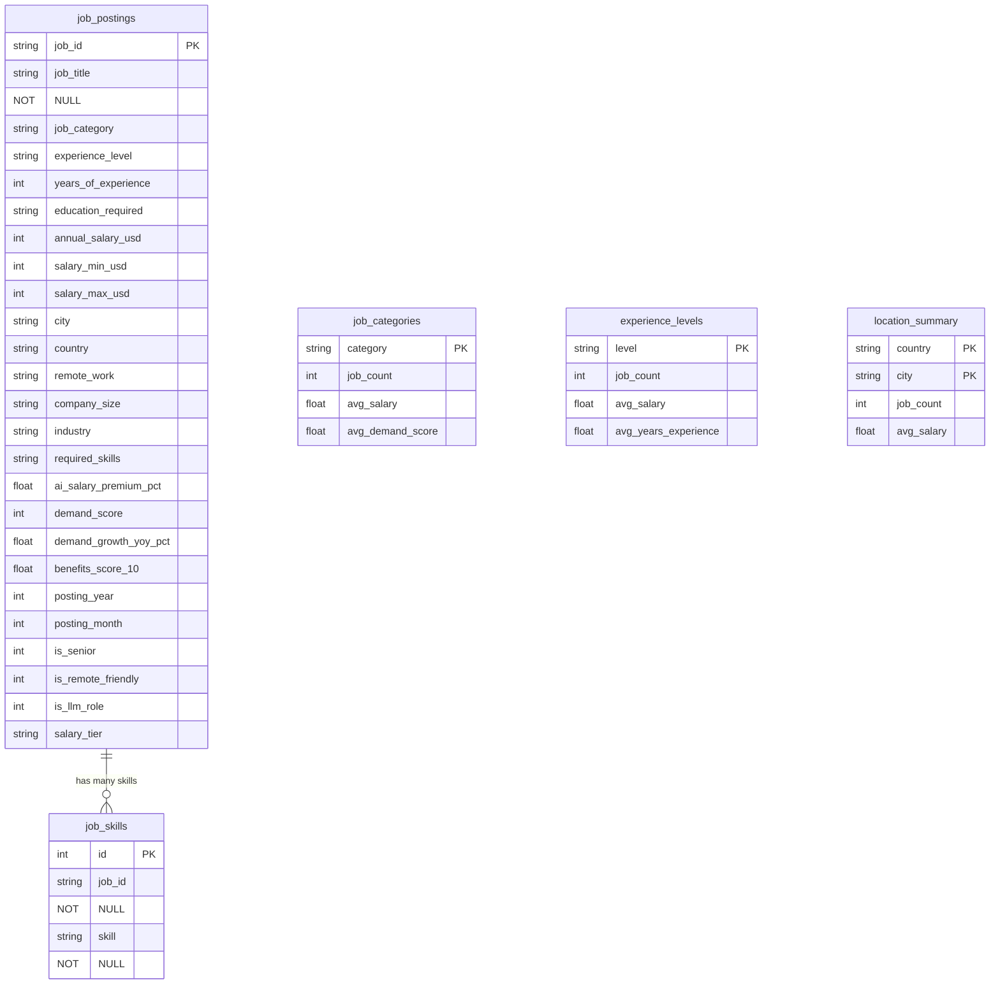

# ER Diagram (Auto-generated)

```mermaid
erDiagram
    job_postings {
        string job_id PK
        string job_title NOT NULL
        string job_category
        string experience_level
        int years_of_experience
        string education_required
        int annual_salary_usd
        int salary_min_usd
        int salary_max_usd
        string city
        string country
        string remote_work
        string company_size
        string industry
        string required_skills
        float ai_salary_premium_pct
        int demand_score
        float demand_growth_yoy_pct
        float benefits_score_10
        int posting_year
        int posting_month
        int is_senior
        int is_remote_friendly
        int is_llm_role
        string salary_tier
    }

    job_skills {
        int id PK
        string job_id NOT NULL
        string skill NOT NULL
    }

    job_categories {
        string category PK
        int job_count
        float avg_salary
        float avg_demand_score
    }

    experience_levels {
        string level PK
        int job_count
        float avg_salary
        float avg_years_experience
    }

    location_summary {
        string country PK
        string city PK
        int job_count
        float avg_salary
    }

    job_postings ||--o{ job_skills : "has many skills"

    %% job_categories, experience_levels, and location_summary are derived summary tables.
    %% They are regenerated from job_postings and do not have foreign-key relationships.
```
